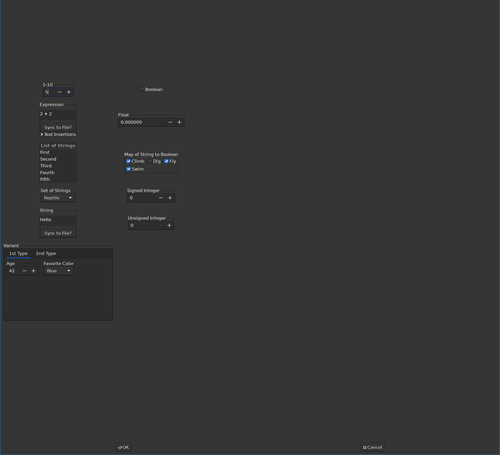
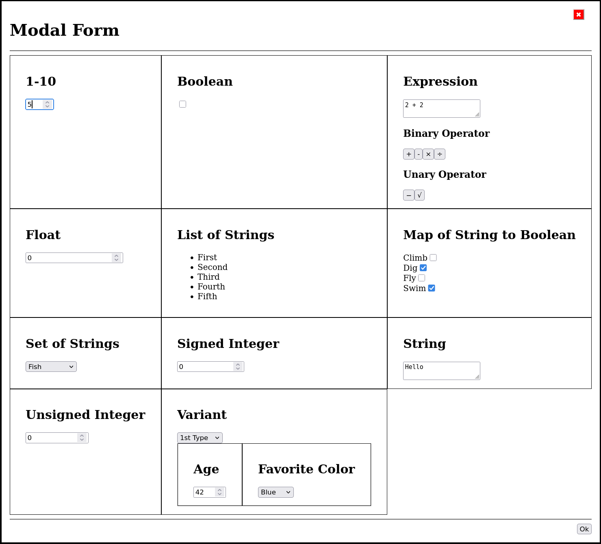

# CanForm (Canvas Form)

Create forms that appear as dialog windows to edit data

Supports
| Data Type 	    | Widget     |
| -------------- | ---------- |
| Boolean   	   | Checkbox   |
| String    	   | Textbox    |
| Number         | Textbox that only allow numbers within a range |
| List of Strings | List of Buttons that can be re-organized |
| Set of Strings | Combox Box |
| Map of String to Boolean | List of Checkboxes |
| Variant       | Forms separated by Labels |

## Backends
- [x] Implemented with GTK for desktops
- [x] Implemented with Emscripten for web browsers
- [ ] Implemented for Android
- [ ] Implemented for iOS

## Screenshots

### GTK

### Web Browsers
